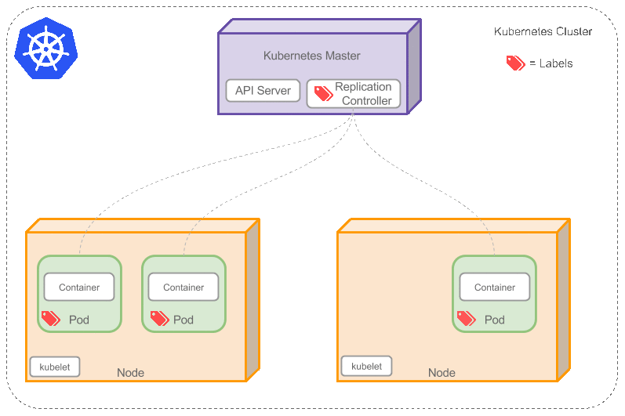

# 基本

> ps : Google Container Registry 可以是 docker hub or quay.io
> ps : Google Container Engine (GKE) 可以是 Amazon CloudFormation

1. 建立 docker image，推送到 docker registry
2. 建立 kubernete cluster (GKE / ACF)
3. 部署 image 到 kubernete cluster

## Registry
- 可以是 docker hub / Google Container Registry(GCR) / Amazon Elastic Container Registry(ECR) / quay.io
- 負責儲存 docker-image

## Kubernete cluster
- GKE (Google Kubernetes Engine) / ACF(Amazon CloudFormation)
- 處理 kubernete 的相關服務 : pod / deployment / services ...

## Instance
- AWS EC2
- GCP Computer Engine

# Kubernete system
## cluster 
- 

- cluster 包含
	- Container
	- Pod
	- Label
	- Node
	- Replication Controller
	- Service
	- Kubernetes Master

## pod 
是 containers 的集合

## Lable
- 負責標記 pods(deployment) or pod
- 透過 selector 指定 label，來標注目標物

## Node
- 物理或者虛擬機器，作為 Kubernetes worker
- 包含
	- Kubelet
	- Kube-proxy
	- Docker

## Deployment 
- 提供 pods 與 rs(Replica Sets : 版本的控制器) 的描述
- use case:
	- 建立 Deployment : Replica Set 與 Pods
	- 檢查 Deployment 狀態
	- 更新 Depolyment, 重新建立 Pods
	- 回滾回早期版本
	- 暫停與復原 Deployment

## Replication Controllers(rc) 

負責動態創建與摧毀 pod (e.g. when scaling up or down or when doing rolling updates)

## services

<!---->

- 定義 pod 對接的多種相關服務, ex: external ip
- Service 通過 Label 找到 Pods

