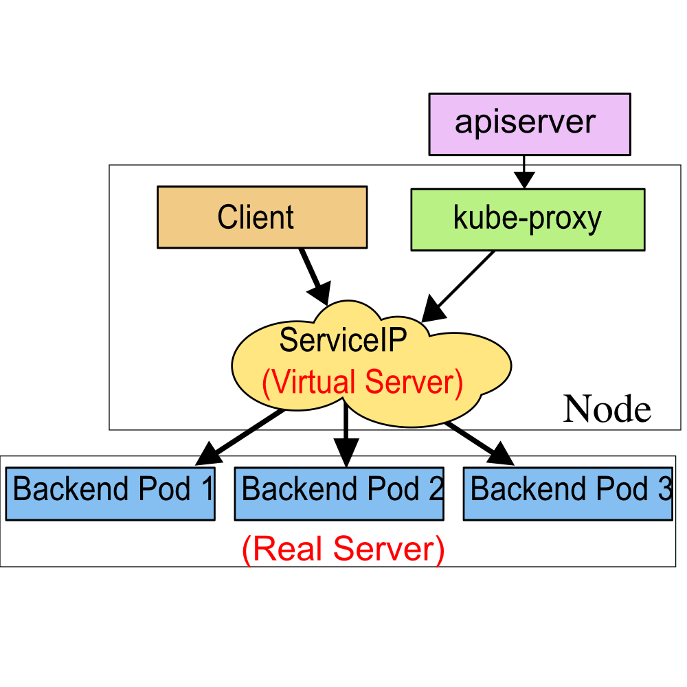

# 基本

> ps : Google Container Registry 可以是 docker hub or quay.io
> ps : Google Container Engine (GKE) 可以是 Amazon CloudFormation

1. 建立 docker image，推送到 docker registry
2. 建立 kubernete cluster (GKE / ACF)
3. 部署 image 到 kubernete cluster

## Registry
- 可以是 docker hub / Google Container Registry(GCR) / Amazon Elastic Container Registry(ECR) / quay.io
- 負責儲存 docker-image

## Kubernete cluster
- GKE (Google Kubernetes Engine) / ACF(Amazon CloudFormation)
- 處理 kubernete 的相關服務 : pod / deployment / services ...

## Instance
- AWS EC2
- GCP Computer Engine

# Kubernete system

## cluster 

- cluster 包含
	- Container
	- Pod
	- Label
	- Node
	- Replication Controller
	- Service
	- Kubernetes Master

## Pod 
> A pod (as in a pod of whales or pea pod) is a group of one or more containers (such as Docker containers)

- 是一個 container 
- pods 是多個 containers 的集合

## Lable
- 負責標記 pods(deployment) or pod
- 透過 selector 指定 label，來標注目標物

## Node
- 物理 / 虛擬機器 / 實體電腦 ，作為 Kubernetes worker
- 包含
	- Kubelet : 負責管理 node 並與 kubernetes master 進行溝通
	- Kube-proxy 
		- 負責 service 的實現
		- 管理 service 的 Endpoints, 內外訪問入口 
		- ex : virtual = iptables config , real = instance
	- Docker : 處理 container 的操作
- 在 kube cluster 中如 worker 般運作

## Deployment 
- 提供 pods 與 rs(Replica Sets : 版本的控制器) 的描述
- use case:
	- 建立 Deployment : Replica Set 與 Pods
	- 檢查 Deployment 狀態
	- 更新 Depolyment, 重新建立 Pods
	- 回滾回早期版本
	- 暫停與復原 Deployment

## Replication Controllers(rc) 

- 負責動態創建與摧毀 pod 
- ex: scaling up or down, or rolling updates

## services

- 定義 pod 對接的多種相關服務, ex: external ip
- Service 通過 Label 找到 Pods

## Kubernetes Master
- 負責管理叢級
- 協調所有在叢集中的行為, such as scheduling applications, maintaining applications' desired state, scaling applications, and rolling out new updates.

