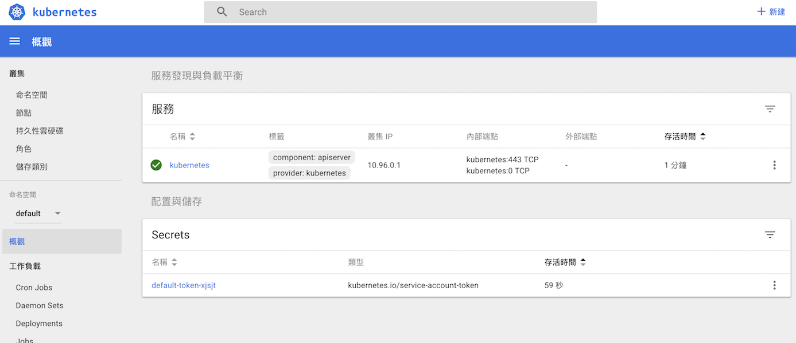

# Synopsis

- 透過本地端，練習 kubenetes client 
- 使用 minikube&virtualbox 當作 kube cluster
- minikube 本身提供像 gcloud 一樣 GUI 介面，方便具有既視感
	- docker 本身提供的 kubernetes cluster 目前沒有 GUI 介面
- Minikube 是一個輕量化的，透過 VM 在本地端執行的機器，有如 kubernetes cluster
- Minikube CLI 提供基本的 cluster 操作 : start, stop, status, delete

# 安裝與使用 minikube
1. 安裝 [virtual box](https://www.virtualbox.org/wiki/Downloads)
  - 此次安裝的版本為 5.2.8
  - mac 安裝失敗問題 : http://blog.csdn.net/u013247765/article/details/78176079
    - mac 安全性與隱私問題
2. 安裝 minikube : https://github.com/kubernetes/minikube
  - osx : `brew cask install minikube`
3. 啟動 minikube : `minikube start`, 須等待約5分鐘建立環境
  - 若遇到失敗 : `minikube delete`
  - 開啟控制台 : `minikube dashboard`
4. use
  - [操作方法](https://kubernetes.io/docs/tutorials/stateless-application/hello-minikube/)
  - [Github](https://github.com/kubernetes/minikube)

## dashboard

# deploy app
## use config to deploy

1. kubectl 取得授權 : `kubectl config use-context minikube`
2. `kubectl create -f {config.yml}`, 在 config 中塞入 image 位置
3. `kubectl get servies`
	- 會看到 external-ip 一直都會是 pending 的狀態
	- 使用 `minikube service {service-name}`
4. `kubectl delete -f {config.yml}`